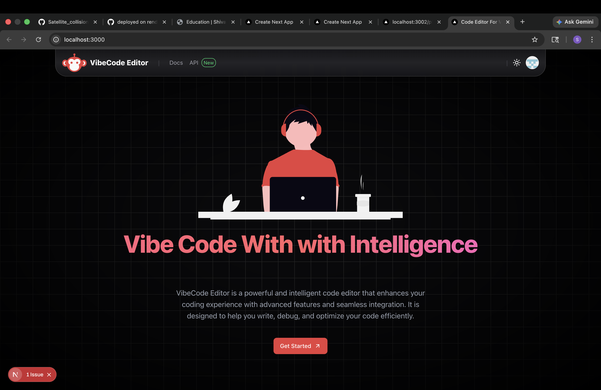
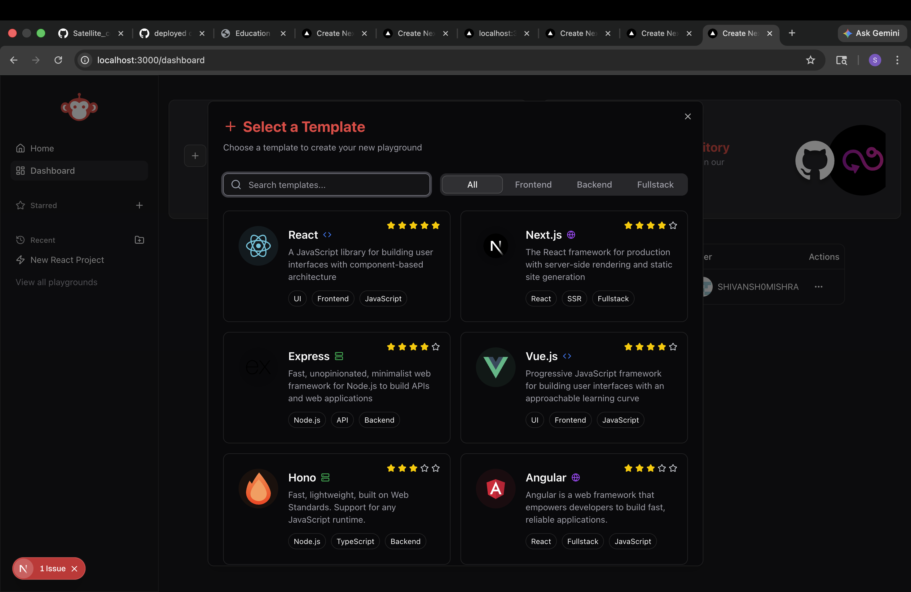
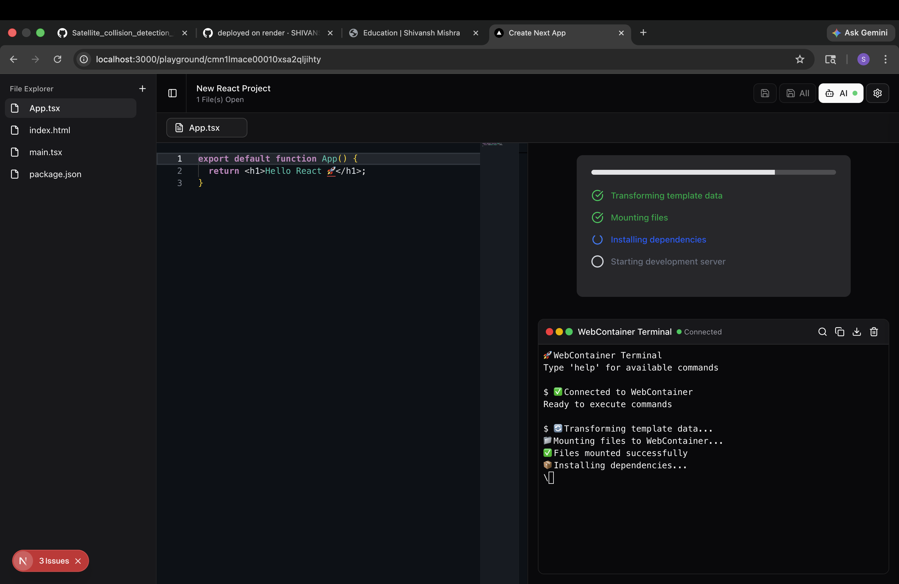
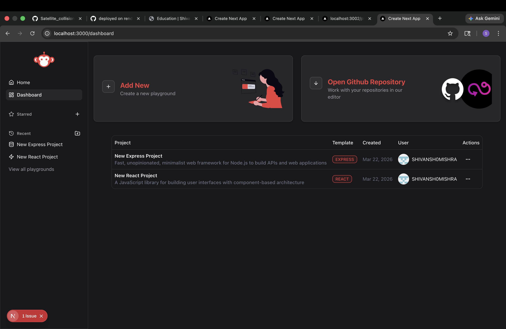

# 🧠 Vibecode Editor – AI-Powered Web IDE


**Vibecode Editor** is a browser-based, AI-powered development environment that enables users to write, run, and debug full-stack applications entirely in the browser. It combines **WebContainers**, **Monaco Editor**, and **local LLMs (Ollama)** to deliver a seamless coding experience without requiring any local setup.

---

## 🚀 Live Demo

> ⚠️ *Demo version has limited functionality (AI features require local setup)*
> 🔗 **Coming Soon**
---

## ✨ Key Features

* 🧑‍💻 **In-Browser Code Execution**
  Run full-stack apps directly in the browser using WebContainers.

* 🖊️ **Monaco Editor Integration**
  VS Code-like editor with syntax highlighting, formatting, and shortcuts.

* 🧱 **Dynamic Project Templates**
  Supports multiple templates (React, Express, Next.js, etc.).

* 🗂️ **Custom File System**
  Create, rename, and manage files/folders in real-time.

* 💻 **Embedded Terminal (xterm.js)**
  Run commands and interact with your app environment.

* 🤖 **AI Code Assistance (Local LLM)**
  Integrated with Ollama for code suggestions and chat-based help.

* 🔐 **Authentication System**
  OAuth-based login using Google & GitHub via NextAuth.

* 🎨 **Modern UI**
  Built with TailwindCSS and ShadCN UI, with dark/light mode support.

---

## 🧱 Tech Stack

| Layer    | Technology                       |
| -------- | -------------------------------- |
| Frontend | Next.js (App Router), TypeScript |
| UI       | TailwindCSS, ShadCN UI           |
| Editor   | Monaco Editor                    |
| Runtime  | WebContainers                    |
| Terminal | xterm.js                         |
| Backend  | Next.js API Routes               |
| Database | MongoDB                          |
| Auth     | NextAuth (OAuth)                 |
| AI       | Ollama (Local LLM)               |

---

## 🏗️ System Architecture

The core system follows a dynamic template-based execution pipeline:

```
Template Folder → JSON Structure → WebContainer Mount → Runtime Execution
```

### Flow:

1. Templates are stored as directory structures.
2. Backend scans and converts them into JSON.
3. JSON is sent to frontend.
4. WebContainers mount the file system.
5. Dependencies install and app runs inside browser.

💡 *This architecture enables a fully browser-based development experience similar to tools like CodeSandbox and StackBlitz.*

---

## ⚙️ Getting Started (Local Setup)

### 1. Clone the repository

```bash
git clone https://github.com/your-username/vibecode-editor.git
cd vibecode-editor
```

### 2. Install dependencies

```bash
npm install
```

### 3. Setup environment variables

```bash
cp .env.example .env.local
```

Fill in:

```env
AUTH_SECRET=
AUTH_GOOGLE_ID=
AUTH_GOOGLE_SECRET=
AUTH_GITHUB_ID=
AUTH_GITHUB_SECRET=
DATABASE_URL=
NEXTAUTH_URL=http://localhost:3000
```

---

### 4. Start Ollama (for AI features)

```bash
ollama run codellama
```

---

### 5. Run development server

```bash
npm run dev
```

Visit:

```
http://localhost:3000
```

---

## 📂 Project Structure

```
vibecode-editor/
├── app/                  # Next.js App Router
├── components/           # UI components
├── modules/              # Core logic (playground, AI, etc.)
├── vibecode-starters/    # Template projects
├── lib/                  # Utilities (DB, auth, etc.)
```

---

## 🧪 Demo Limitations

* AI features require **local Ollama setup**
* Some templates depend on **WebContainer runtime**
* Full functionality works best in local environment

---

## 📸 Screenshots
### 📊 Dashboard

### 🧑‍💻 Editor Interface



### 💻 Terminal Execution



### 🚀 Running Application



---

## 🚀 Future Improvements

* 🌐 Cloud-based AI integration (OpenAI / API-based)
* 📦 Template marketplace
* 👥 Real-time collaboration (like Google Docs)
* 🧠 Smarter AI code generation & refactoring
* ⚡ Faster template loading & caching

---

## 🤝 Acknowledgements

* WebContainers
* Monaco Editor
* Ollama
* Next.js
* xterm.js

---

## 📄 License

MIT License

---

## 💡 Inspiration

Inspired by tools like CodeSandbox, StackBlitz, and VS Code — aiming to bring a powerful development environment fully into the browser.

---

## ⭐ Show Your Support

If you found this project useful, consider giving it a ⭐ on GitHub!
